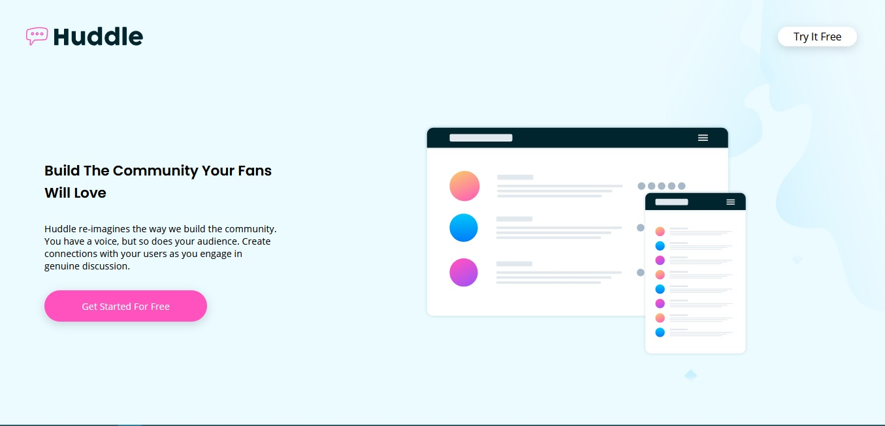
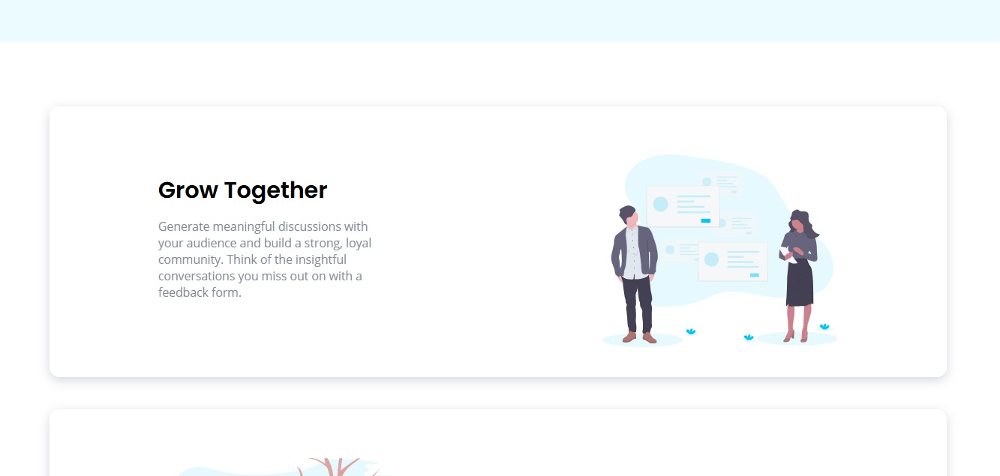
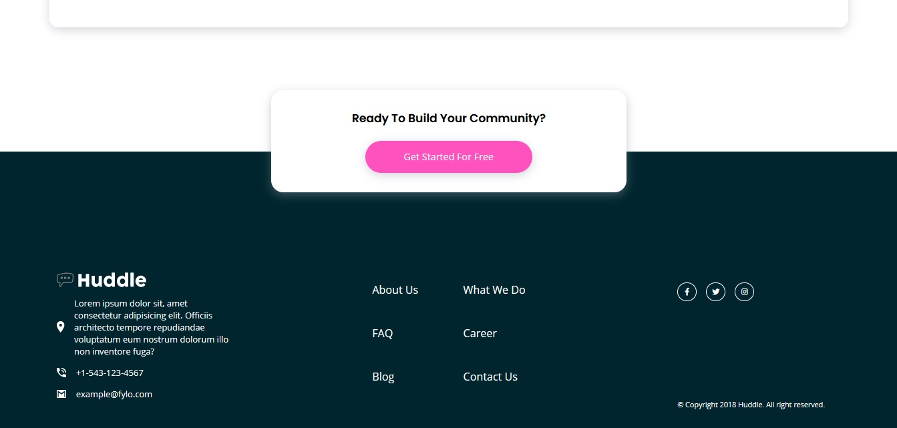

# Frontend Mentor - Huddle landing page with single introductory section

This landing page was done as practice for a fictional company called Huddle. The project was done in vanilla HTML and sass.

## Screeshots

## Getting Started

## Viewing the site

- Fork or clone the repository to your local machine.
- Open the folder using any editor of your choice (vscode was used).
- Enter gulp in your terminal to open the start the site.

## Editing the site

- Edit the index.html as you see fit.
- To style you can edit the style.scss file under the app folder.
- To run a live preview of the website run gulp in your terminal to compile scss to css.

## Stack

- HTML
- Sass
- Gulp

## Author

- [Motheo Keneilwe](https://github.com/mtkrated)

## Acknowledegments

- My thanks goes to the people at [Front-End-Mentor](https://www.frontendmentor.io/solutions) for providing quality projects.
